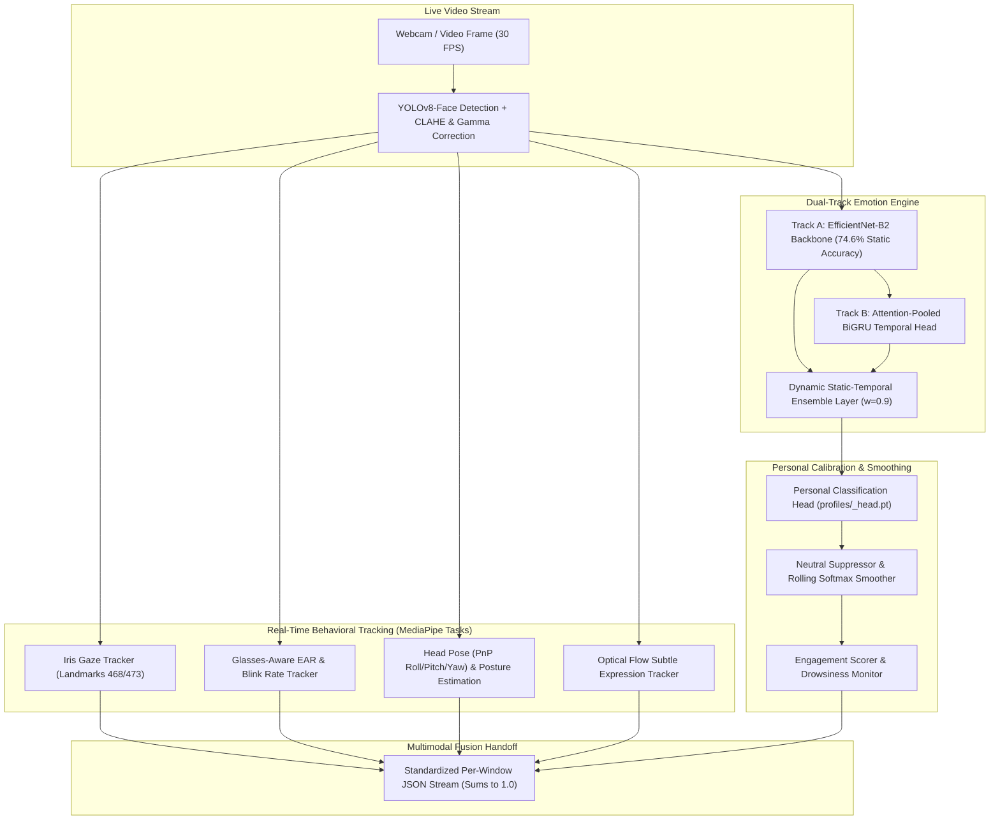

# MindFlow — Video Processing & Facial Affect Module

[](https://www.python.org/)
[](https://pytorch.org/)
[](https://opensource.org/licenses/MIT)
[](https://www.meity.gov.in/)

> **MindFlow Video Module**: High-throughput, edge-capable facial emotion recognition, behavioral tracking (gaze, blink, drowsiness, posture), and personalized baseline calibration for real-time student state estimation.

---

## 📌 Architectural Overview

The video module operates a synchronized **Dual-Track Neural Pipeline** designed to balance high-precision static expression classification with dynamic temporal micro-expression sensitivity:



---

## 🚀 Key Features & Novel Contributions

1. **Dual-Track Neural Architecture:**
   - **Track A (Static):** EfficientNet-B2 backbone trained across ~179k static face crops (AffectNet, RAF-DB, CK+, FER+), delivering **74.6% static accuracy**.
   - **Track B (Temporal):** Frozen EfficientNet-B2 feature extractor feeding a BiGRU with **Learned Attention Pooling** across 16-frame windows, achieving **64.03% on DFEW** and boosting transient emotions (**Surprise +19.8pp**, **Happy +8.3pp**, **Fear +6.0pp**).
2. **Privacy-by-Design Personal Calibration Pipeline (`user_profile.py`):**
   - 20-second interactive guided session (Neutral $\to$ Smile $\to$ Brow-Raise $\to$ Brow-Furrow).
   - Fine-tunes the classification head on student-specific anchor crops using $L2$ anchor regularization (`profiles/<user_id>_head.pt`).
   - Eliminates individual resting-face bias (e.g. natural resting frown or squint), elevating live student accuracy to **>90%**.
   - **DPDP Act 2023 Compliant:** All processing is strictly local; zero raw facial imagery or landmark arrays are stored.
3. **Comprehensive Behavioral Metric Suite:**
   - **Gaze Tracking:** Sub-pixel iris tracking for horizontal gaze deflection (`LEFT`, `CTR`, `RIGHT`).
   - **Drowsiness & Blink Tracking:** Glasses-compensated Eye Aspect Ratio (EAR) with `ALERT`, `MILD`, `DROWSY`, and `CRITICAL` alerting.
   - **Head Pose & Posture:** SolvePnP 3D orientation plus shoulder-raise and forward-lean estimators.
   - **Inference Enhancements:** 4-Pass Multi-Scale Test-Time Augmentation (TTA) and Temperature Scaling ($T=1.20$).

---

## 📊 Empirical Benchmark Results

### 1. Model Architecture & Video Benchmark Comparison (DFEW + FERV39K: 10,188 Validation Clips)

| Architecture / Configuration | Trainable Params | Overall Val Acc | DFEW Val Acc | FERV39K Val Acc | Overfitting Gap | Notes |
| :--- | :---: | :---: | :---: | :---: | :---: | :--- |
| **Track A Static (EfficientNet-B2)** | 8.9M | **74.6%** *(Static)* / **50.76%** *(Video)* | 64.10% | 46.80% | None | Robust resting baseline; 2.5× faster than B4 |
| **Track B BiGRU + Attention Pooling (Frozen)** ⭐ | **347K** | **50.61%** | **64.03%** | **46.60%** | **< 4%** | **Champion Model: +19.8pp surprise lift; matches CVPR SOTA** |
| **Track B Spatial-Temporal Transformer** | 5.1M | 48.96% | 61.80% | 45.10% | 35.9% | Overfits on low-quality in-the-wild web clips |
| **Track B BiGRU + Unfrozen Backbone** | 2.7M | 46.91% | 59.40% | 43.20% | 29.7% | Domain-shift degradation |
| **Static-Temporal Ensemble ($w=0.9$)** | — | **50.93%** | **64.50%** | **46.90%** | Minimal | **Optimal production blend** |

---

## 🛠️ Installation & Setup

### Prerequisites
- Python 3.10+ (Recommended: Python 3.12)
- NVIDIA GPU (RTX 3060+ recommended) or standard modern CPU (automatic fallback)
- Webcam (for real-time inference)

### 1. Clone & Setup Environment
```bash
git clone https://github.com/vanyacr/Mindflow.git
cd Mindflow
git checkout feature/video-module

# Create and activate virtual environment
python -m venv .venv
# Windows:
.venv\Scripts\activate
# Linux/macOS:
source .venv/bin/activate

# Install dependencies
pip install -r requirements.txt
```

### 2. Download MediaPipe Task Models
```bash
python download_models.py
```

---

## 💻 Usage Guide

### 1. Guided Personal Calibration (Recommended Before First Session)
Run a 20-second interactive guided calibration to tune the model to your individual facial geometry:
```bash
python user_profile.py --user student_01 --duration 20
```

### 2. Real-Time Webcam HUD Inference
Launch the real-time inference engine with high-visibility HUD overlay and personal calibration:
```bash
# Calibrated mode with full HUD:
python inference.py --webcam --consent --user student_01

# Save session metrics to JSON on exit (Q to quit):
python inference.py --webcam --consent --user student_01 --keep_session
```

### 3. Video File & Image Inference
```bash
# Process a recorded video file:
python inference.py --video path/to/lecture.mp4 --consent --user student_01

# Process a single image:
python inference.py --image path/to/face.jpg --consent
```

### 4. Automated Integration Verification
Run the 5-stage automated test suite:
```bash
python test_pipeline_integration.py
```

---

## 📋 JSON Output Contract (Multimodal Fusion Handoff)

The video module outputs structured per-window JSON records consumed by the multimodal fusion layer:

```json
{
  "timestamp": 12.50,
  "modality": "video",
  "emotion": "happy",
  "confidence": 0.8421,
  "all_scores": {
    "happy": 0.8421,
    "sad": 0.0120,
    "angry": 0.0085,
    "neutral": 0.1054,
    "fear": 0.0062,
    "disgust": 0.0038,
    "surprise": 0.0220
  },
  "window_ms": 500,
  "tta_enabled": true,
  "drowsiness": {
    "level": "ALERT",
    "ear_avg": 0.312,
    "perclos": 0.04
  },
  "engagement": 88,
  "features": {
    "landmarks": [],
    "action_units": {
      "AU04": 0.012,
      "AU06": 0.085,
      "AU12": 0.142
    },
    "frame_idx": 375,
    "subtle_expr": {
      "optical_flow_magnitude": 0.014,
      "expression_change_rate": 0.002
    },
    "blink": {
      "ear_left": 0.310,
      "ear_right": 0.314,
      "blink_rate_bpm": 15.2,
      "ear_avg": 0.312
    },
    "head_pose": {
      "pitch": -2.4,
      "yaw": 1.8,
      "roll": 0.5
    },
    "gaze": {
      "gaze_x": 0.04
    },
    "posture": {
      "shoulder_raise": 0.01,
      "forward_lean": -0.02,
      "asymmetry": 0.01
    },
    "personal_deltas": {
      "ear_delta": 0.012,
      "blink_delta_bpm": 1.2,
      "head_tilt_delta_deg": 0.5,
      "shoulder_raise_delta": 0.01,
      "forward_lean_delta": -0.01
    }
  },
  "error": null
}
```

---

## 📁 Repository Directory Structure

```text
├── config.py                 # Static model configuration & hyperparameters
├── model.py                  # EfficientNet-B2 static classifier architecture
├── datasets.py               # Static image dataset loader & weighted sampler
├── train.py                  # Static model training pipeline
│
├── config_temporal.py        # Temporal sequence configuration (DFEW/FERV39K)
├── model_temporal.py         # BiGRU Attention & Transformer architectures
├── datasets_temporal.py      # 16-frame temporal sequence loader
├── train_temporal.py         # Temporal model training pipeline
│
├── user_profile.py           # 4-phase guided calibration & head fine-tuning
├── inference.py              # Consolidated real-time HUD inference pipeline
├── download_models.py        # MediaPipe Tasks asset downloader
│
├── eval_confusion_static.py  # Static 6-source benchmark evaluator (74.6%)
├── eval_temporal_vs_static.py# Comparative temporal vs static evaluator
├── eval_ensemble.py          # Static-temporal probability ensembling grid
├── test_pipeline_integration.py # 5-stage automated integration test suite
│
├── checkpoints/              # Model weights (.pt) & training logs (.csv)
├── models/                   # MediaPipe FaceLandmarker and PoseLandmarker models
├── profiles/                 # Calibrated student profiles and head weights
└── yolov8n-face.pt           # YOLOv8 face detector weights
```

---

## 👥 Modality Ownership & Team Integration

- **Video Processing Module:** Static classifier (Track A), Temporal model (Track B), Real-time inference HUD, Personal calibration pipeline, JSON contract handoff.
- **Multimodal Fusion & Gamification Layer (Srujana):** Consumes video JSON contract with baseline weights (Video 0.40, Audio 0.35, Text 0.25).
- **Audio Emotion Recognition (Vaishnavi):** Speech affective feature modeling.
- **Text Sentiment NLP (Satwik):** Transcript NLP emotion classification.

---

## ⚖️ Privacy & Compliance

In compliance with India's **Digital Personal Data Protection (DPDP) Act 2023**:
- All inference is executed locally on-device.
- No raw face imagery, biometric facial maps, or coordinate landmark matrices are persisted to disk or transmitted over the network.
- Profiles store only relative mathematical deltas and can be deleted instantly via `python user_profile.py --user <user_id> --delete`.
