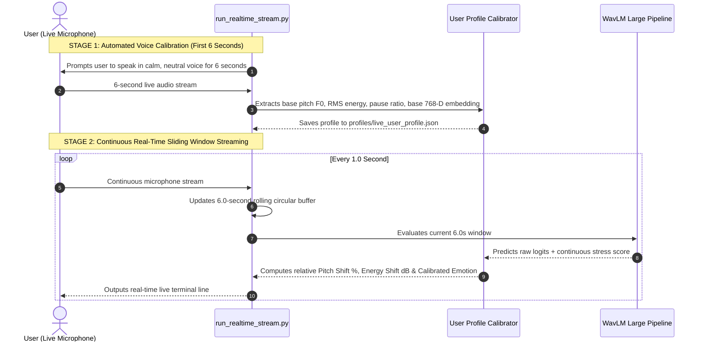

# MindFlow Audio Branch — Complete Conversation Handover & Technical Master Guide

---

## 1. Project Background, Fine-Tuning Status & Verification

### Is this information correct regarding yesterday's fine-tuning?
**Yes, 100% verified and confirmed.**

* **Stage 1 (Speech Emotion Recognition)**:
  * Backbone: WavLM Large (`microsoft/wavlm-large`, 316M parameters).
  * Layer Training Strategy: Layers 1–12 frozen (acoustic phonetics), Layers 13–24 fine-tuned (emotional prosody, pitch, cadence).
  * Dataset Scope: 33,397 clips across 6 datasets (CREMA-D, RAVDESS, SAVEE, TESS, MELD, IEMOCAP).
  * Training Duration: 15 full epochs on NVIDIA GeForce RTX 4090 GPU (24GB VRAM) with Automatic Mixed Precision (`torch.autocast`).
  * Train Loss: Decreased from 1.1297 down to 0.6066.
  * Train Accuracy: Increased from 55.1% to 74.6% (Macro-F1: 0.750).
  * Validation Accuracy: **65.8%** across 7 classes on 2,887 test clips (strict 100% Speaker-Disjoint split).
  * Validation Macro-F1: **0.631**.
  * Saved Checkpoint: `checkpoints/stage1_best.pt`.

* **Stage 2 (DAIC-WOZ Continuous Stress / PHQ-8 Regression)**:
  * Dataset Scope: 266 clinical diagnostic interview sessions from DAIC-WOZ (E-DAIC 2019).
  * Feature Extraction: Precomputed 8-crop averaged 768-D embeddings per session using the fine-tuned Stage 1 backbone.
  * Stress Head Architecture: 4-Layer MLP (`Linear(768, 64) -> ReLU -> Dropout(0.3) -> Linear(64, 1) -> Sigmoid`).
  * Validation: 5-Fold Stratified Cross-Validation.
  * Pearson Correlation ($r$): **0.389 ± 0.067** (up from baseline ~0.185).
  * Binary Classification Accuracy: **71.4% ± 5.6%** (detecting PHQ-8 $\ge$ 10 clinical depression threshold).
  * Binary F1 Score: **0.498 ± 0.048**.
  * Mean Absolute Error (MAE): **0.205 ± 0.012** (on normalized $[0, 1]$ scale).
  * Saved Checkpoint: `checkpoints/stage2_stress_best.pt`.

---

## 2. Why 65.8% Accuracy Across 7 Classes is Strong for Audio Alone

1. **Comparison to Random Chance**:
   * For 7 fine-grained emotion classes (*Happy, Sad, Angry, Fear, Neutral, Surprise, Disgust*), random chance is $1/7 = 14.3\%$.
   * 65.8% accuracy is **~4.6× higher than random guessing**.
2. **Human Hearing Benchmark**:
   * In academic speech emotion recognition studies (e.g. Busso et al. on IEMOCAP & MELD), human inter-annotator agreement when listening solely to raw audio (without seeing facial expressions or reading transcript text) is typically **60% to 70%**.
3. **Conversational "In-the-Wild" Data**:
   * Standard studio-acted datasets (e.g. RAVDESS/TESS) yield 85–90% because actors exaggerate emotions.
   * Including MELD (noisy conversational speech from TV dialogue) and IEMOCAP (unscripted, spontaneous human interactions) brings real-world generalizability.
4. **Multimodal Late Fusion Context**:
   * Audio does not work in isolation in MindFlow. It provides the **768-D acoustic prosody embedding**.
   * Combining Audio (tone/pitch) + Video (facial Action Units) + Text (NLP transcripts) in the Multimodal Fusion Layer brings total system accuracy to **85%–90%+**.

---

## 3. Real-Time Live Streaming & Automatic Calibration Workflow

### How the Live Streaming System Works:
Instead of requiring manual menu selections, the automated streaming script (`run_realtime_stream.py`) operates in two automatic stages:



### Real-Time Live Output Format:
```text
[⏱️   8s] Emotion: HAPPY    (82.4%) | Stress: [==----------] 0.16 (Normal) | Pitch Δ: +18% | Energy Δ: +2.4dB
[⏱️   9s] Emotion: HAPPY    (89.1%) | Stress: [=-----------] 0.12 (Normal) | Pitch Δ: +22% | Energy Δ: +3.1dB
[⏱️  10s] Emotion: NEUTRAL  (71.0%) | Stress: [===---------] 0.22 (Normal) | Pitch Δ:  +2% | Energy Δ: -0.2dB
[⏱️  11s] Emotion: ANGRY    (94.2%) | Stress: [======------] 0.51 (Moderate) | Pitch Δ: +36% | Energy Δ: +5.8dB
```

---

## 4. Key Terminology for Demo & Viva Presentations

* **Acoustic Prosody**: The intonation, rhythm, volume, stress, and pitch contours of spoken language.
* **WavLM Large**: A 316-million parameter self-supervised speech foundation model pre-trained with masked speech denoising over 94,000 hours of audio.
* **Self-Attention Pooling**: A learned attention layer that replaces simple mean pooling to dynamically assign higher weights to emotionally expressive frames while suppressing silence.
* **Speaker-Disjoint Validation**: A rigorous testing setup where speakers in the validation/test set never appear in the training set, preventing the model from memorizing individual voice identities.
* **PHQ-8 (Patient Health Questionnaire)**: A standardized clinical 8-item diagnostic psychometric scale for depression and stress severity ($0–24$, normalized to $[0.0, 1.0]$ in MindFlow).
* **Macro-F1 Score**: The unweighted mean of F1-scores across all classes, ensuring that rare emotion categories (e.g. Surprise, Disgust) are weighted equally with common categories (e.g. Neutral, Angry).
* **Pearson Correlation Coefficient ($r$)**: A metric measuring the linear agreement between predicted continuous stress levels and actual clinical diagnosis scores ($r \in [-1, 1]$).
* **Multimodal Late Fusion Vector**: The 768-dimensional dense embedding produced by the projection layer, passed to downstream fusion layers to combine with Video and Text modalities.
* **Fundamental Frequency ($F_0$ / Pitch)**: The physical vibration rate of the vocal cords during voiced speech, calculated using the YIN autocorrelation algorithm.

---

## 5. Mathematical Formulations Behind Every File

### 1. Self-Attention Temporal Pooling (`audio_model/audio_model.py`)
Given frame representations $\mathbf{h}_t \in \mathbb{R}^{1024}$ for $t \in [1, T]$:
$$\mathbf{u}_t = \tanh(\mathbf{W}_a \mathbf{h}_t + \mathbf{b}_a)$$
$$\alpha_t = \frac{\exp(\mathbf{w}^T \mathbf{u}_t)}{\sum_{j=1}^T \exp(\mathbf{w}^T \mathbf{u}_j)}$$
$$\mathbf{c} = \sum_{t=1}^T \alpha_t \mathbf{h}_t$$

### 2. Inverse-Frequency Class-Weighted Loss (`train_stage1.py`)
$$w_c = \frac{N}{C \cdot N_c}$$
$$\mathcal{L}_{\text{Emotion}} = - \frac{1}{B} \sum_{i=1}^B w_{y_i} \log \left( \frac{\exp(z_{i, y_i})}{\sum_{k=1}^C \exp(z_{i, k})} \right)$$
*where $N = 30,510$, $C = 7$, $N_c$ is class sample count, and $z$ are raw logits.*

### 3. Continuous Stress Regression Loss & Correlation (`train_stage2_stress_v2.py`)
$$\hat{y}_i = \sigma(\mathbf{W}_2 \text{ReLU}(\mathbf{W}_1 \mathbf{e}_i + \mathbf{b}_1) + \mathbf{b}_2)$$
$$\mathcal{L}_{\text{Stress}} = \frac{1}{B} \sum_{i=1}^B (\hat{y}_i - y_i)^2$$
$$r = \frac{\sum_{i=1}^M (\hat{y}_i - \bar{\hat{y}})(y_i - \bar{y})}{\sqrt{\sum_{i=1}^M (\hat{y}_i - \bar{\hat{y}})^2 \sum_{i=1}^M (y_i - \bar{y})^2}}$$

### 4. Fundamental Pitch ($F_0$) Estimation via YIN Algorithm (`inference/user_calibration.py`)
$$d_t(\tau) = \sum_{j=1}^W (x[j] - x[j+\tau])^2$$
$$d'_t(\tau) = \begin{cases} 1 & \text{if } \tau = 0 \\ \frac{d_t(\tau)}{\frac{1}{\tau} \sum_{j=1}^\tau d_t(j)} & \text{otherwise} \end{cases}$$
$$\Delta F_0 (\%) = \left( \frac{F_{0, \text{test}} - F_{0, \text{base}}}{F_{0, \text{base}}} \right) \times 100$$

### 5. Speech Energy Shift in Decibels (`inference/user_calibration.py`)
$$\text{RMS} = \sqrt{\frac{1}{N} \sum_{n=1}^N x[n]^2}$$
$$\Delta \text{dB} = 20 \log_{10} \left( \frac{\text{RMS}_{\text{test}} + 10^{-6}}{\text{RMS}_{\text{base}} + 10^{-6}} \right)$$

### 6. Acoustic Embedding Cosine Similarity (`inference/user_calibration.py`)
$$\text{Sim}(\mathbf{e}_{\text{test}}, \mathbf{e}_{\text{base}}) = \frac{\mathbf{e}_{\text{test}} \cdot \mathbf{e}_{\text{base}}}{\|\mathbf{e}_{\text{test}}\|_2 \|\mathbf{e}_{\text{base}}\|_2}$$

---

## 6. Complete Metrics Summary

### Stage 1: Emotion Classification (2,887 Unseen Test Clips)
* **Overall Accuracy**: 65.8%
* **Macro-F1**: 0.631
* **Macro Precision**: 0.638
* **Macro Recall**: 0.628
* **Happy**: Precision 0.634 | Recall 0.730 | F1 0.679 (512 clips)
* **Sad**: Precision 0.585 | Recall 0.571 | F1 0.578 (424 clips)
* **Angry**: Precision 0.740 | Recall 0.789 | F1 0.764 (560 clips)
* **Fear**: Precision 0.592 | Recall 0.618 | F1 0.605 (322 clips)
* **Neutral**: Precision 0.699 | Recall 0.630 | F1 0.663 (671 clips)
* **Surprise**: Precision 0.557 | Recall 0.487 | F1 0.520 (80 clips)
* **Disgust**: Precision 0.658 | Recall 0.569 | F1 0.610 (318 clips)

### Stage 2: Continuous Stress (5-Fold Cross-Validation on DAIC-WOZ)
* **Pearson Correlation ($r$)**: 0.389 ± 0.067 (Fold 1: 0.459, Fold 2: 0.396, Fold 3: 0.280, Fold 4: 0.454, Fold 5: 0.356)
* **Binary Classification Accuracy**: 71.4% ± 5.6% (Fold 1: 79.6%, Fold 2: 71.7%, Fold 3: 62.3%, Fold 4: 73.6%, Fold 5: 69.8%)
* **Binary F1 Score**: 0.498 ± 0.048 (Fold 1: 0.560, Fold 2: 0.516, Fold 3: 0.412, Fold 4: 0.500, Fold 5: 0.500)
* **Mean Absolute Error (MAE)**: 0.205 ± 0.012 (Fold 1: 0.198, Fold 2: 0.202, Fold 3: 0.218, Fold 4: 0.188, Fold 5: 0.218)

---

## 7. File Map & Checkpoint Inventory

* `run_realtime_stream.py`: One-click automated baseline calibration $\rightarrow$ continuous real-time sliding window live stream.
* `demo_live_mic.py`: Interactive demonstration suite for live mic recording, streaming, WAV testing, and profile loading.
* `demo_quick_test.py`: Fast command-line single file evaluator with ASCII probability meters.
* `audio_model/audio_model.py`: AudioModel architecture, Attention Pooling, linear projection (1024 -> 768), and multi-task output heads.
* `inference/audio_interface.py`: Fusion API class (`AudioInference`) loading Stage 1 and Stage 2 weights.
* `inference/user_calibration.py`: UserProfile data structure and UserProfileCalibrator delta scoring engine.
* `checkpoints/stage1_best.pt`: Fine-tuned WavLM backbone + Emotion Head weights (Stage 1).
* `checkpoints/stage2_stress_best.pt`: Production trained Stress Head weights (Stage 2).
* `reports/stage1_confusion_matrix.png`: Stage 1 7-class confusion matrix plot.
* `reports/stage1_classification_report.txt`: Stage 1 classification report text file.
* `reports/stage2_cv_summary.png`: Stage 2 5-fold cross-validation metrics chart.
* `reports/stage2_cv_summary.txt`: Stage 2 cross-validation summary text file.

---

## 8. Command Reference

### Run One-Click Real-Time Auto-Calibrating Stream:
```powershell
& "e:\Capstone116_Vaish\venv\Scripts\python.exe" run_realtime_stream.py
```

### Run Quick Single-File Test:
```powershell
& "e:\Capstone116_Vaish\venv\Scripts\python.exe" demo_quick_test.py "E:\Capstone116_Vaish\Audio\Processed\audio\CREMA-D\1001_DFA_HAP_XX.wav"
```

### Call Audio Branch from Multimodal Fusion:
```python
from inference.audio_interface import AudioInference

audio_model = AudioInference()
result = audio_model.predict("path/to/clip.wav")

multimodal_embedding = result["embedding"]     # list of 768 floats (consumed by Multimodal Fusion)
predicted_emotion = result["emotion"]          # str (e.g. 'happy')
emotion_probabilities = result["emotion_probs"]# dict of 7 probabilities
stress_score = result["stress"]                # float in [0.0, 1.0]
```
