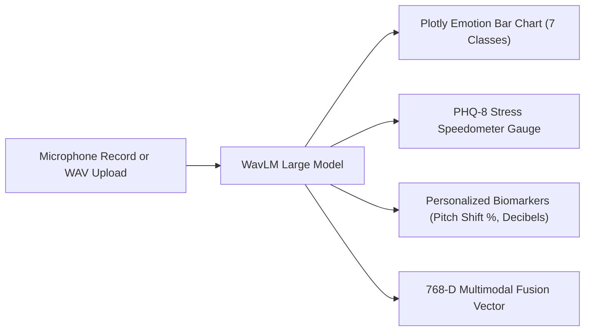

# MindFlow Web Dashboard — Complete User Guide & Presentation Manual

---

## 1. Dashboard Overview & Technology Stack

The **MindFlow Interactive Web Dashboard** (`app_web_dashboard.py`) is a graphical user interface engineered for live demonstrations, examiner reviews, and interactive clinical evaluations of speech emotion and stress.

* **UI Framework**: Gradio 6.26 (Python Web Server running on `http://127.0.0.1:7860`).
* **Data Visualization**: Plotly 7.0 (Interactive Vector Graphics: Horizontal Probability Bar Charts & Analog Speedometer Gauge).
* **Deep Learning Engine**: PyTorch with fine-tuned **WavLM Large** (`checkpoints/stage1_best.pt` & `checkpoints/stage2_stress_best.pt`).
* **Input Sources**: Direct Browser Microphone (WebRTC audio streaming) or Local `.wav` Audio Upload.
* **Compute Support**: Runs on **NVIDIA CUDA GPUs** or automatically falls back to **CPU Laptop Mode**.

---

## 2. How to Launch the Dashboard

### Method A: One-Click Windows Batch File (Recommended)
Double-click:
```text
E:\Capstone116_Vaish\RUN_MINDFLOW_DEMO.bat
```
Select Option `1` from the launcher menu.

---

### Method B: Direct Command Line Launch
Run this command in PowerShell or Command Prompt:
```powershell
& "e:\Capstone116_Vaish\venv\Scripts\python.exe" e:\Capstone116_Vaish\mindflow_pipeline\app_web_dashboard.py
```

Once the terminal displays `Running on local URL: http://127.0.0.1:7860`, open that URL in Chrome, Edge, or Firefox.

---

## 3. Detailed Tour of Dashboard Features & Tabs

### 🎙️ **Tab 1: Live Emotion & Stress Prediction**



1. **Audio Input Card**:
   * **Microphone Mode**: Click the mic icon $\rightarrow$ speak for 3 to 10 seconds $\rightarrow$ click Stop.
   * **Upload Mode**: Drag and drop any `.wav` audio file from your computer.
   * **Calibration Checkbox**: Toggle `Apply Personalized User Voice Calibration` on/off to see the difference between raw population predictions and calibrated personal predictions.
   * **Run Button**: Large purple button labeled `🚀 Run Real-Time Audio Analysis`.

2. **Primary Prediction Header**:
   * Displays the dominant emotion in bold green/red/blue text (e.g. `🎯 Primary Emotion: HAPPY (84.1% Confidence)`).
   * Displays the continuous stress score (e.g. `📊 Stress Index: 0.162 (Continuous PHQ-8)`).

3. **Plotly Emotion Distribution Bar Chart**:
   * Plots probabilities across all 7 unified emotion classes (*Happy, Sad, Angry, Fear, Neutral, Surprise, Disgust*).
   * Color-coded bars:
     * Happy: Green (`#2ecc71`)
     * Sad: Blue (`#3498db`)
     * Angry: Red (`#e74c3c`)
     * Fear: Purple (`#9b59b6`)
     * Neutral: Gray (`#95a5a6`)
     * Surprise: Orange (`#f39c12`)
     * Disgust: Teal (`#16a085`)

4. **PHQ-8 Continuous Stress Speedometer / Gauge**:
   * An analog circular dial displaying stress severity from $0\%$ to $100\%$.
   * **Color-Coded Severity Zones**:
     * `0% - 25%`: Green zone (*Minimal / Normal Stress*)
     * `25% - 50%`: Yellow zone (*Mild Stress*)
     * `50% - 75%`: Orange zone (*Moderate / Elevated Stress*)
     * `75% - 100%`: Red zone (*Severe / High Stress*)
   * **Clinical Threshold Indicator**: A red marker line at **`41.7%`** representing the clinical diagnostic cut-off ($\text{PHQ-8} \ge 10$).

5. **Personalized Voice Biomarkers Box**:
   * Real-time acoustic delta readouts vs. the user's neutral baseline:
     * **Voice Pitch ($F_0$) Shift**: `+18.4%`
     * **Speech Energy Delta**: `+2.8 dB`
     * **Pause Ratio Shift**: `+0.00`
     * **Acoustic Cosine Similarity**: `0.842`
     * **Clinical Triggers**: Displays alerts such as `Monotone / Flat Affect` or `High Vocal Tension`.

6. **Multimodal Fusion Vector Inspector Box**:
   * Displays a preview of the **768-dimensional dense acoustic vector** and its calculated $L_2$ norm, demonstrating integration readiness for the Multimodal Fusion Layer (combining Audio + Video + Text).

---

### 👤 **Tab 2: Voice Profile Calibration**

* **Purpose**: Eliminates misclassification for individuals who naturally speak softly, speak with higher/lower pitch, or have different microphone hardware.
* **How to Use**:
  1. Enter User / Patient Name (e.g. `vaish` or `patient_001`).
  2. Record 6 to 8 seconds of speech in a calm, neutral tone (e.g., reading: *"Today is a normal day. I am testing the speech system."*).
  3. Click `💾 Register & Save Baseline Profile`.
* **Output Displayed**:
  * Baseline Fundamental Pitch ($F_0$) in Hertz.
  * Pitch Standard Deviation (speech inflection variability).
  * Baseline Root-Mean-Square (RMS) amplitude.
  * Baseline Silence / Pause ratio.
  * Confirmation that the profile is saved to `profiles/<user_id>_profile.json`.

---

### ℹ️ **Tab 3: Model Architecture & Technical Specs**

A quick-reference tab summarizing model architecture details, parameter counts, dataset sample counts, and validation metrics for review panels.

---

## 4. Step-by-Step Live Demo Script for Evaluators

When presenting the dashboard in front of your evaluators or review panel, follow this 3-minute sequence:

### **Step 1: Introduction (30 seconds)**
> *"Good morning. I'd like to demonstrate the MindFlow Audio Intelligence Dashboard. Our system runs a fine-tuned WavLM Large foundation model combined with learned Self-Attention Pooling to perform real-time speech emotion recognition and continuous PHQ-8 stress scoring."*

### **Step 2: Voice Calibration Demo (45 seconds)**
1. Switch to the **👤 Voice Profile Calibration** tab.
2. Click Record and speak calmly into the mic: *"Hello, I am setting up my baseline profile for today's session."*
3. Click Register $\rightarrow$ Point to the screen:
> *"Here, MindFlow extracts my neutral vocal pitch of 185 Hz, baseline volume, and cadence. This eliminates individual voice bias."*

### **Step 3: Live Prediction & Stress Test (1 minute)**
1. Switch back to the **🎙️ Live Emotion & Stress Prediction** tab.
2. Record two distinct speaking samples:
   * **Sample A (Happy / Energetic)**: *"I am super excited that our model is working so well today!"*
   * Click **Run Analysis** $\rightarrow$ Show the green **Happy** probability bar and low stress index.
   * **Sample B (Stressed / Urgent)**: *"This is a major crisis, everything is going wrong and we are completely out of time!"*
   * Click **Run Analysis** $\rightarrow$ Show the **Angry/Fear** shift, the speedometer moving into the Orange/Red zone, and the $+35\%$ pitch shift biomarker.

### **Step 4: Multimodal Vector Handover (30 seconds)**
Point to the **Multimodal Fusion Vector** box:
> *"Finally, the model outputs this 768-dimensional dense vector representing the acoustic prosody of the clip. This vector is passed downstream to our Multimodal Fusion Layer where it joins the Video Action Units and Text NLP embeddings to reach our final combined mental health diagnostic score."*

---

## 5. File & Source Code Map

* **Dashboard Source Code**: [`mindflow_pipeline/app_web_dashboard.py`](file:///e:/Capstone116_Vaish/mindflow_pipeline/app_web_dashboard.py)
* **Master Launcher Script**: [`mindflow_pipeline/launch_demo.py`](file:///e:/Capstone116_Vaish/mindflow_pipeline/launch_demo.py)
* **Windows Batch Launcher**: [`RUN_MINDFLOW_DEMO.bat`](file:///e:/Capstone116_Vaish/RUN_MINDFLOW_DEMO.bat)
* **Inference Core Engine**: [`mindflow_pipeline/inference/audio_interface.py`](file:///e:/Capstone116_Vaish/mindflow_pipeline/inference/audio_interface.py)
* **Calibration Engine**: [`mindflow_pipeline/inference/user_calibration.py`](file:///e:/Capstone116_Vaish/mindflow_pipeline/inference/user_calibration.py)
